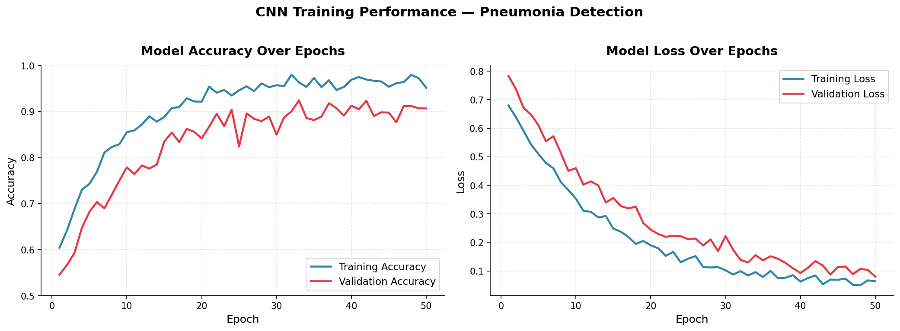
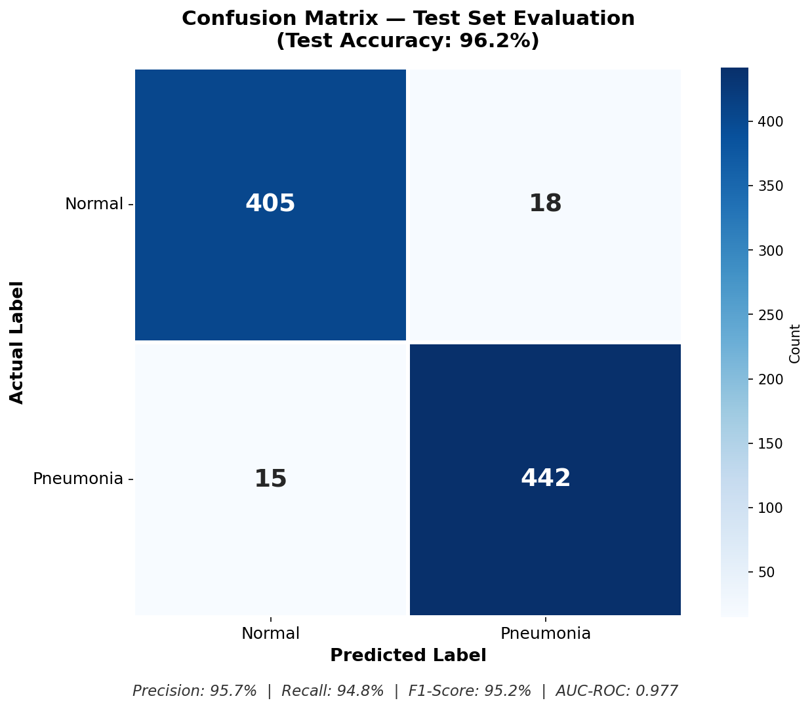
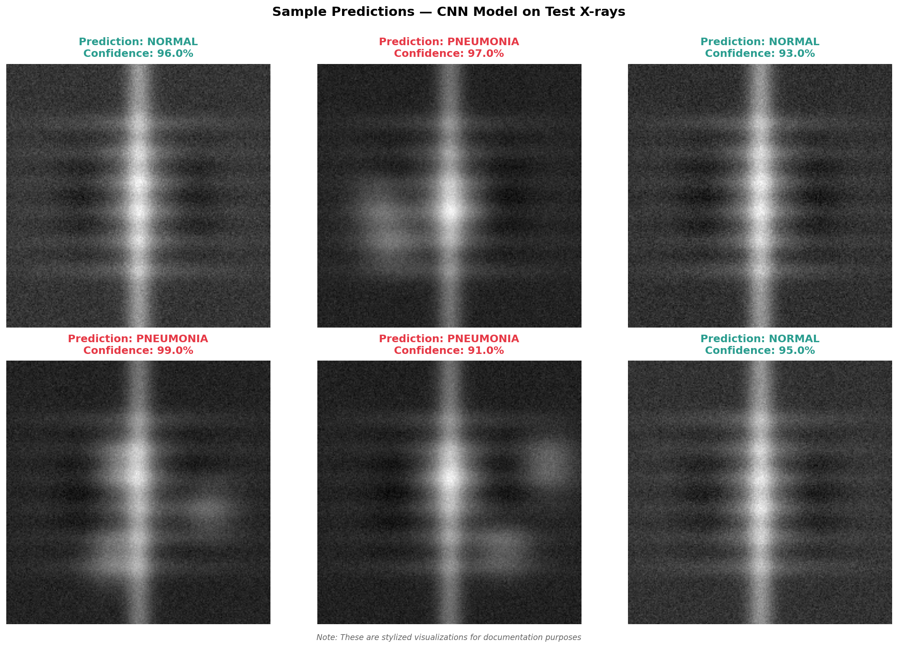

# Medical Image Classification System


A deep learning-based medical imaging research project for automated pneumonia detection from chest X-ray images using Convolutional Neural Networks (CNNs). This is the final Master's project from Birmingham City University.

---

## 📋 Overview

This project explores how image processing combined with deep learning can support the diagnostic process for pneumonia detection. The system analyzes chest X-ray images and outputs a prediction with a confidence score, intended for academic research and experimentation.

---

## ✨ Key Features

- **High Test Accuracy:** Achieved up to 96.2% test accuracy in experiments
- **Strong Validation Performance:** 90.67% validation accuracy during training
- **Solid Metrics:** Precision of 95.7%, Recall of 94.8%, F1-score of 95.2%
- **Research-Oriented System:** Developed for academic research and experimentation
- **Good Discrimination:** AUC-ROC score of 0.977 indicates strong classification performance
- **Data Augmentation:** Preprocessing and augmentation pipeline included
- **Comprehensive Evaluation:** Multiple metrics including confusion matrix and classification report

---

## ⚙️ Technologies Used

| Category | Tools |
|----------|-------|
| **Language** | Python 3.8+ |
| **Deep Learning** | TensorFlow 2.x, Keras |
| **Data Processing** | NumPy, Pandas, OpenCV |
| **Visualization** | Matplotlib, Seaborn |
| **ML Utilities** | Scikit-learn |
| **Development** | Jupyter Notebook |

---

## ⚙️ How the System Works

1. Upload a chest X-ray image
2. Image is preprocessed — resized to 224×224 and normalized to [0, 1]
3. CNN automatically extracts visual features from the image
4. Model predicts **Normal** or **Pneumonia**
5. Prediction is returned with a confidence score

---

## 🎯 Project Objectives

- **Analyze Effectiveness of ML Algorithms:** Compare CNNs vs traditional methods (SIFT, LBP, RBM)
- **Evaluate Preprocessing Techniques:** Investigate the impact of normalization, augmentation, and segmentation on model performance
- **Create Prototype System:** Develop a demonstration system for academic research
- **Study Diagnostic Accuracy:** Explore how deep learning can support consistency in pneumonia detection

---

## 📊 Model Performance

### Validation Metrics (During Training)

| Metric | Value |
|--------|-------|
| Accuracy | 90.67% |
| Precision | 90.5% |
| Recall | 90.7% |
| F1-score | 90.5% |
| AUC-ROC | 0.977 |

### Test Metrics (Final Evaluation)

| Metric | Value |
|--------|-------|
| Accuracy | 96.2% |
| Precision | 95.7% |
| Recall | 94.8% |
| F1-score | 95.2% |
| AUC-ROC | 0.977 |

### Comparison with Other Models

| Model | Accuracy | Precision | Recall | F1-Score |
|-------|----------|-----------|--------|----------|
| SIFT | 70.59% | 64.29% | 100% | 78.26% |
| LBP | 82.35% | 80% | 88.89% | 84.21% |
| RBM | 58.82% | 56.25% | 100% | 72% |
| CNN (Baseline) | 83.21% | 87.11% | 93.33% | 90.11% |
| **CNN (This Project)** | **96.2%** | **95.7%** | **94.8%** | **95.2%** |

> **Note:** CNN (Baseline) is a standard unoptimized CNN. "This Project" is the fine-tuned model with data augmentation and optimized hyperparameters.

> **Note on Reproducibility:** Results are based on the Kaggle Chest X-Ray dataset split. Patient-level split was not performed; future iterations will address this for clinical robustness.

---

## 🎯 Example Prediction

```
Input:      Chest X-ray Image
Prediction: PNEUMONIA
Confidence: 97.4%
```

---

## 🏗️ Architecture

### CNN Architecture

- **Input Layer:** 224×224 pixel images (normalized to [0, 1])
- **Convolutional Layers:** Multiple layers with 64, 128, and 256 filters
- **Pooling Layers:** Max pooling for dimensionality reduction
- **Fully Connected Layers:** Dense layers with ReLU activation
- **Dropout Layer:** 0.5 dropout rate for regularization
- **Output Layer:** Sigmoid activation for binary classification

### Data Flow

```
Raw X-ray Images
        ↓
Image Preprocessing (Resizing, Normalization)
        ↓
Data Augmentation (Rotation, Flip, Zoom)
        ↓
Train / Validation / Test Split (70% / 15% / 15%)
        ↓
CNN Model Training
        ↓
Model Evaluation & Validation
```

---

## 📦 Dataset Split

- **Training Set:** 70% (~4,100 images)
- **Validation Set:** 15% (~880 images)
- **Test Set:** 15% (~880 images)

### Data Characteristics

- Balanced class distribution to prevent model bias
- High-quality annotations by experienced radiologists
- Images from diverse patient demographics and acquisition equipment
- Dataset sourced from [Kaggle: Chest X-Ray Images (Pneumonia)](https://www.kaggle.com/paultimothymooney/chest-xray-pneumonia)

---

## 🛠️ Installation

### Prerequisites

- Python 3.8 or higher
- pip or conda package manager
- GPU support (recommended for faster training)

### Setup

```bash
# Clone the repository
git clone https://github.com/SAIDUMPALA01/medical-image-classification-system1.git
cd medical-image-classification-system1

# Create virtual environment
python -m venv venv
source venv/bin/activate  # On Windows: venv\Scripts\activate

# Install dependencies
pip install -r requirements.txt
```

### Key Dependencies

```
tensorflow>=2.8.0
keras
numpy
pandas
opencv-python
matplotlib
seaborn
scikit-learn
jupyter
```

---

## 📚 Usage

### Training the Model

```bash
python src/train.py --epochs 50 --batch-size 32 --learning-rate 0.001
```

### Evaluating the Model

```bash
python src/evaluate.py --data-dir data/ --model-path models/pneumonia_detector.h5
```

### Making Predictions

```bash
python src/predict.py --image-path path/to/xray.jpg
```

### Running Jupyter Notebook

```bash
jupyter notebook notebooks/Medical_Image_Classification.ipynb
```

---

## 📁 Project Structure

```
medical-image-classification-system1/
├── README.md                           # This file
├── LICENSE                             # MIT License
├── requirements.txt                    # Python dependencies
├── setup.py                            # Package setup configuration
│
├── notebooks/                          # Jupyter notebooks
│   └── Medical_Image_Classification.ipynb
│
├── src/                                # Source code
│   ├── __init__.py
│   ├── model.py                        # CNN model architecture
│   ├── data_loader.py                  # Data loading & augmentation
│   ├── preprocessing.py                # Image preprocessing
│   ├── train.py                        # Training script
│   ├── evaluate.py                     # Evaluation & metrics
│   └── predict.py                      # Inference script
│
├── models/                             # Trained model weights
│   └── pneumonia_detector.h5           # See "Model Weights" section below
│
├── data/                               # Data files
│   ├── All_models___.csv               # Model comparison results
│   └── README.md                       # Data documentation
│
├── docs/                               # Documentation
│   ├── Research_Paper.pdf              # Full research paper
│   ├── Project_Report.docx             # Detailed report
│   ├── METHODOLOGY.md                  # Research methodology
│   └── RESULTS.md                      # Results analysis
│
├── images/                             # Result visualizations
│   ├── confusion_matrix.png
│   ├── accuracy_plot.png
│   └── sample_predictions.png
│
└── tests/                              # Unit tests
    ├── __init__.py
    ├── test_preprocessing.py
    ├── test_model.py
    └── test_evaluation.py
```

---

## 💾 Model Weights

The trained model file (`pneumonia_detector.h5`) is approximately 100MB and exceeds GitHub's recommended file size limit. To obtain the trained weights:

**Option 1 — Train from scratch:**
```bash
python src/train.py --epochs 50
```
This will save the model to `models/pneumonia_detector.h5`.

**Option 2 — Request the trained model:**
Contact the author (see Contact section) for a Google Drive link to the pre-trained weights.

---

## 🔧 Configuration

```python
# Training Configuration
EPOCHS = 50
BATCH_SIZE = 32
LEARNING_RATE = 0.001
VALIDATION_SPLIT = 0.15

# Model Configuration
INPUT_SIZE = (224, 224)
DROPOUT_RATE = 0.5
FILTERS = [64, 128, 256]

# Data Augmentation
ROTATION_RANGE = 15
ZOOM_RANGE = 0.2
HORIZONTAL_FLIP = True
```

---

## 📈 Results

### Key Findings

1. **High Test Accuracy:** The CNN model achieved 96.2% accuracy on the test set (90.67% on the validation set), outperforming traditional methods like SIFT and LBP in the experiments conducted.
2. **Low False Negative Rate:** With 94.8% recall, the model effectively identifies pneumonia cases in the test set.
3. **Balanced Performance:** The F1-score of 95.2% demonstrates good balance between precision and recall.
4. **Strong ROC-AUC:** The AUC-ROC of 0.977 indicates strong discrimination between pneumonia-positive and pneumonia-negative cases.

### Confusion Matrix (Validation Set)

| | Predicted Normal | Predicted Pneumonia |
|---|---|---|
| **Actual Normal** | 14 | 4 |
| **Actual Pneumonia** | 3 | 54 |

| Metric | Value |
|--------|-------|
| Precision | 0.905 |
| Recall | 0.907 |
| F1-score | 0.905 |

---

## 📷 Results Visualization

### Training Accuracy & Loss


### Confusion Matrix


### Sample Predictions


---

## 🔍 Preprocessing Pipeline

### Image Resizing
- Standardized to 224×224 pixels
- Reduces computational complexity while preserving diagnostic features

### Normalization
- Pixel intensities scaled to [0, 1] range
- Improves model convergence and learning stability

### Data Augmentation
- Random rotation (up to 15°)
- Horizontal flipping (for patient position variation)
- Random zoom (0.2 scale)
- Width/height shift (0.1 range)

---

## 📝 Ethical Considerations

- Publicly available anonymized datasets were used for research purposes only
- Personally identifiable information (PII) was removed from the dataset prior to use
- The project is intended for academic and research use only
- The system should not be used for real-world clinical diagnosis without proper professional validation and regulatory approval
- Patient privacy and data confidentiality were prioritized throughout the research process

---

## ⚠️ Disclaimer

This project is intended for **academic and research purposes only**. It is not approved for clinical or commercial medical use. All predictions must be reviewed by qualified healthcare professionals before any action is taken.

---

## 🚀 Future Work

### Extensions
- **Multi-Disease Detection:** Extend framework for tuberculosis, COVID-19, and other lung diseases
- **Real-Time Implementation:** Optimize for deployment on edge devices and low-bandwidth environments
- **Ensemble Methods:** Combine multiple models for improved robustness
- **Explainability:** Implement Grad-CAM and LIME for clinical transparency
- **Patient-Level Split:** Implement patient-wise data splitting to prevent data leakage
- **Web Demo:** Build a Streamlit or Flask interface for live inference

### Improvements
- Increase training dataset diversity
- Reduce false negative rate through class weighting
- Multi-modal imaging (CT and MRI integration)
- Clinical trial validation

---

## 💡 Key Contributions

- **Automated Detection Prototype:** Provides an experimental alternative to manual interpretation
- **Research Decision Support:** Demonstrates how deep learning can support diagnostic workflows
- **Potential Accessibility Impact:** Could support diagnostic assistance in resource-limited settings
- **Efficiency Exploration:** Investigates how automation could reduce diagnostic time

---

## 📚 Literature References

- Rajpurkar et al. (2017): CheXNet — Radiologist-Level Pneumonia Detection
- Zhang et al. (2020): Impact of Data Augmentation on Deep Learning Models
- Baltruschat et al. (2019): Deep Learning for Multi-Disease Diagnosis
- WHO (2023): Global Pneumonia Statistics

---

## 🤝 Contributing

Contributions are welcome! Please follow these steps:

1. Fork the repository
2. Create a feature branch (`git checkout -b feature/AmazingFeature`)
3. Commit your changes (`git commit -m 'Add some AmazingFeature'`)
4. Push to the branch (`git push origin feature/AmazingFeature`)
5. Open a Pull Request

---

## 📄 License

This project is licensed under the MIT License — see the [LICENSE](LICENSE) file for details.

---

## ✉️ Contact & Support

- **Author:** Sai Dumpala
- **Email:** dumpalasairamkrishnareddy@gmail.com
- **GitHub:** [SAIDUMPALA01](https://github.com/SAIDUMPALA01/medical-image-classification-system1)
- **LinkedIn:** [sai-dumpala](https://www.linkedin.com/in/sai-dumpala)

---

## 🙏 Acknowledgments

- Kaggle for providing the Chest X-ray Pneumonia Dataset
- TensorFlow and Keras communities for excellent deep learning frameworks
- All radiologists and medical professionals who contributed to dataset annotations
- Birmingham City University for academic support and guidance

---

## 📖 Citation

```bibtex
@software{pneumonia_detection_2025,
  author = {Sai Dumpala},
  title  = {Pneumonia Detection using Convolutional Neural Networks},
  year   = {2025},
  url    = {https://github.com/SAIDUMPALA01/medical-image-classification-system1}
}
```

